This document provides a hyper-detailed set of wireframe prompts for **BudgetPilot**, optimized to ensure accurate UI generation across all responsive breakpoints. These prompts emphasize spatial relationships, CSS token usage, and interaction states as defined in the **MVP Development Brief**.

---

## 🧭 BudgetPilot: Hyper-Detailed Wireframe Specifications

This document provides the complete, hyper-detailed wireframe specification for the **BudgetPilot MVP**. Every feature is expanded across the three responsive breakpoints using the verified template to ensure accurate UI generation and a professional, "finance-grade" aesthetic.

---

## Feature 1: Dashboard View
**Goal:** Visualize financial health at a glance with the unique spending heatmap.

### **Desktop Version (≥ 1024px)**
* **Wireframe Prompt:** A high-fidelity desktop UI wireframe (1440x900px) in a dark "Midnight" theme focused on maximum data density and a professional multi-column layout.
* **Layout Structure:**
    * **Header:** "Dashboard" title in `--bp-text-primary` with a month-picker dropdown ("April 2026") and a "Last Export" status badge.
    * **Top Area:** Four equal cards using `--bp-bg-surface` showing "Income," "Expenses," "Remaining Balance" ($1,800.00), and "Savings Rate" (36%) in monospace font.
    * **Stack:** A middle row with a 60/40 split; the left contains a "Spending Heatmap" month-grid (7x5 rounded squares) with a hovered cell showing a detailed tooltip; the right contains an interactive Donut Chart. The bottom area features a full-width "Recent Transactions" table.
* **Navigation & Interaction:** Fixed 240px sidebar on the left. Floating teal `+` button in the bottom-right corner with a subtle outer glow.
* **Visual Style:** Deep charcoal background (`--bp-bg-base`), 16px corner radiuses on all cards, and high-contrast monospace typography for currency.

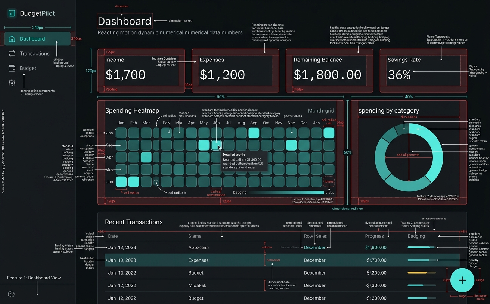

### **Tablet Version (768px – 1023px)**
* **Wireframe Prompt:** A tablet UI wireframe in portrait mode providing a balanced layout with a high-efficiency navigation rail.
* **Layout Structure:** * **Header:** Centered title "Dashboard" with a month-picker (`<` April 2026 `>`).
    * **Top Area:** 2x2 grid of metric cards (Income/Expenses top, Balance/Savings bottom) to maximize vertical space.
    * **Stack:** Full-width Heatmap occupies the center. Below it, the Donut Chart and a simplified list of 4 transactions (Date, Category, Amount) stack vertically.
* **Navigation & Interaction:** 64px left rail. A chevron icon at the top triggers a **Motion One** slide-out menu. Tapping a heatmap cell reveals a tooltip for 3 seconds.
* **Visual Style:** Midnight theme tokens with 16px corner radiuses and large touch-friendly components.

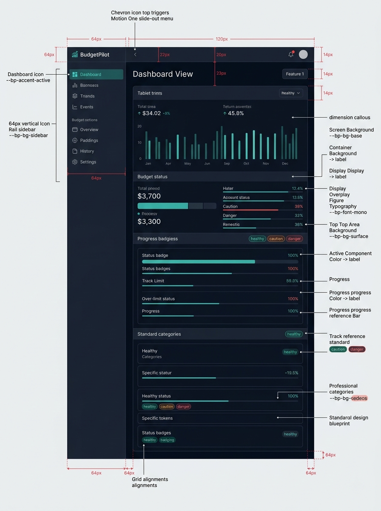

### **Mobile Version (< 768px)**
* **Wireframe Prompt:** A high-fidelity mobile UI wireframe (390x844px portrait) for the "BudgetPilot" Dashboard. The image must represent a **single, integrated mobile screen** in a dark "Midnight" theme. Avoid overlapping windows or multiple navigation bars. The design must feel like a native PWA with a continuous vertical scroll.
* **Layout Structure:**
    * **Header:** A centered month-navigation widget (`<` **APRIL 2026** `>`) using `--bp-text-primary`. Directly below the month, a muted label reads "Last Export: 2d ago" in a smaller font.
    * **Top Area (Metric Stack):** Four full-width summary cards with 16px side margins and 12px vertical spacing. 
        * **Remaining Balance Card:** Positioned at the top; 120px tall. Features a large `$1,800.00` in monospace font and a glowing teal trend sparkline (`--bp-accent`) on the right.
        * **Metric Cards:** Three subsequent cards for "Income," "Expenses," and "Savings Rate" (36%) using high-contrast text.
    * **Stack (Content Area):** * **Spending Heatmap:** A full-width centerpiece grid of 7 columns (Sun–Sat) and 5 rows. Cells are rounded squares (`--bp-radius-sm`). One red cell (Apr 16) is active with a sleek, dark teal tooltip anchored directly above it reading "Apr 16: $125.00 Total".
        * **Recent Activity List:** A section header followed by three transaction cards. Each card displays the "Merchant Name" and "Amount" on the top line, and a "Category Badge" and "Date" on the bottom line.
* **Navigation & Interaction:**
    * **Floating Action Button (FAB):** A singular, circular teal `+ Add` button (44x44px) positioned 16px above the bottom tab bar on the right side.
    * **Bottom Tab Bar:** A persistent, clean 64px dark bar at the absolute bottom with 4 distinct icons (Home, Transactions, Budget, Settings). The "Home" icon is highlighted in teal.
* **Visual Style & Token Callouts:**
    * **Theme:** Deep charcoal background (`--bp-bg-base`) and surface-colored cards (`--bp-bg-surface`).
    * **Typography:** Strictly use high-contrast monospace for all currency and percentage values (`--bp-font-mono`).
    * **Labels:** Include clean, non-overlapping pointer lines with the following callouts:
        * **"Base Screen Background -> --bp-bg-base"**
        * **"Card Container Background -> --bp-bg-surface"**
        * **"Display Figure Typography -> --bp-font-mono"**
        * **"Active Component Color -> --bp-accent-active"**
        * **"Interactive Heatmap Cell -> --bp-heat-high"**

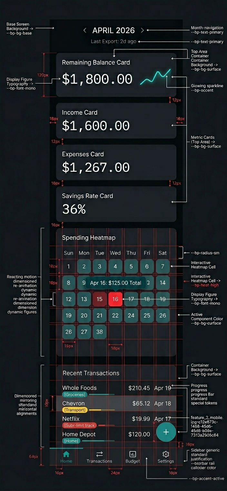

---

## Feature 2: Transactions & Entry Form
**Goal:** Manage the financial audit trail with a guided, validated entry system.

### **Desktop Version (≥ 1024px)**
* **Wireframe Prompt:** A data-management desktop screen showing a high-density `Table` for auditing and manual entry.
* **Layout Structure:**
    * **Header:** "Transactions" title with a global search bar and "Filter" button toolbar.
    * **Top Area:** Summary metrics for the filtered view (e.g., "Filtered Total").
    * **Stack:** High-density table with columns for Date, Category (pill-badge), Description, Note (truncated), and Amount (right-aligned).
* **Navigation & Interaction:** Left sidebar navigation; centered `Dialog` modal for "Add Transaction" with a segmented Expense/Income toggle.
* **Visual Style:** Monospaced numbers, teal badges, and a deep surface color for the table rows.

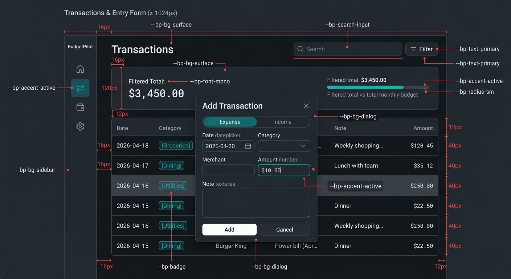

### **Tablet Version (768px – 1023px)**
* **Wireframe Prompt:** A tablet transaction log focusing on high-touch clarity and horizontal efficiency.
* **Layout Structure:** * **Header:** Wide search bar centered above the data list.
    * **Top Area:** Cards showing total monthly expenses versus income.
    * **Stack:** Simplified `Table` removing the "Note" column; "Add" is a floating FAB at the bottom right.
* **Navigation & Interaction:** 64px Icon Rail; "Add Transaction" dialog is widened to 80% viewport width with 48px tall input targets.
* **Visual Style:** Clean theme tokens with large hit areas for touch precision.

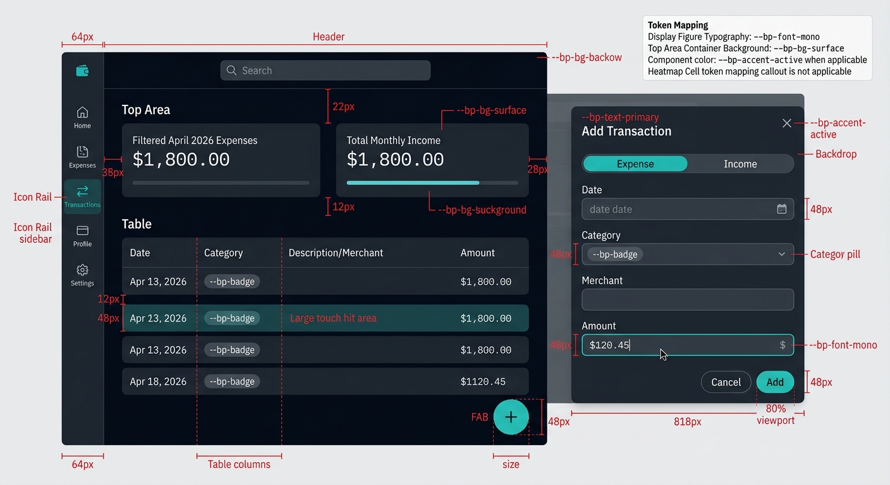

### **Mobile Version (< 768px)**
* **Goal:** A hyper-detailed mobile UI wireframe (390x844px) in a **Dark "Midnight" Theme**, optimized for high-speed, one-handed financial entry.
* **Layout Structure:**
    * **Background Layer (The List):** A list of transaction cards on `--bp-bg-base` (Deep Charcoal). The list is visible but blurred/dimmed behind a 40% black backdrop. One card is partially swiped to the left, revealing a high-contrast red "Trash" icon.
    * **Foreground Layer (The Entry Sheet):** A full-screen surface-colored sheet (`--bp-bg-surface`) slid up from the bottom. 
        * **Upper Half:** A massive **48pt currency input** (`$0.00`) centered at the top in monospace font. Below it, a sleek segmented toggle for "Expense" vs "Income" with the active state in `--bp-accent-active` (Teal).
        * **Lower Half:** An oversized, integrated numeric keypad (0-9, dot, and backspace). Keys should be large with 16px corner radiuses (`--bp-radius-sm`).
* **Navigation & Interaction:**
    * A persistent bottom tab bar is visible at the very bottom, but the entry sheet sits above it.
    * The "Add" button is a prominent primary action in the top right corner of the sheet.
* **Visual Style & Token Callouts:**
    * **Theme:** Strictly use the "Midnight" palette: Deep charcoal background, dark grey surfaces, and teal accents.
    * **Typography:** All currency and keypad numbers must use high-contrast monospace (`--bp-font-mono`).
    * **Mandatory Redline Callouts:** Include clean pointer lines mapping elements to their design tokens:
        * **"Full-screen Sheet Surface -> --bp-bg-surface"**
        * **"Main Background -> --bp-bg-base"**
        * **"Amount Input Typography -> --bp-font-mono"**
        * **"Active Toggle State -> --bp-accent-active"**
        * **"Keypad Button Radius -> --bp-radius-sm"**
        * **"Swipe Action State -> Red / Danger"**
    * **Redline Specs:** Show 12px/16px padding indicators between form fields and keypad rows.

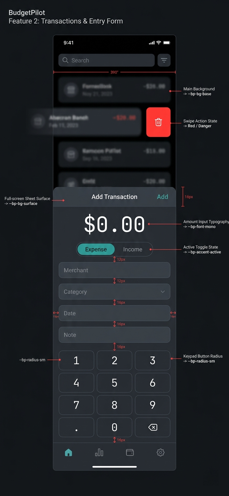

---

## Feature 3: Monthly Budget Planner
**Goal:** Manage 50/30/20 allocation and category-specific monthly limits.

### **Desktop Version (≥ 1024px)**
* **Wireframe Prompt:** A budget planning screen focusing on strategic income allocation and comparison.
* **Layout Structure:**
    * **Header:** Month-picker next to a large "Expected Monthly Income" input field.
    * **Top Area:** Three linked horizontal range sliders: "Needs (50%)", "Wants (30%)", and "Savings (20%)".
    * **Stack:** Three vertical columns each containing categories with progress bars showing "Spent vs. Limit".
* **Navigation & Interaction:** Adjusting sliders dynamically updates group currency values; "Add Category" buttons appear at the bottom of each column.
* **Visual Style:** Teal progress bars for healthy budgets; amber/red for over-limit categories.

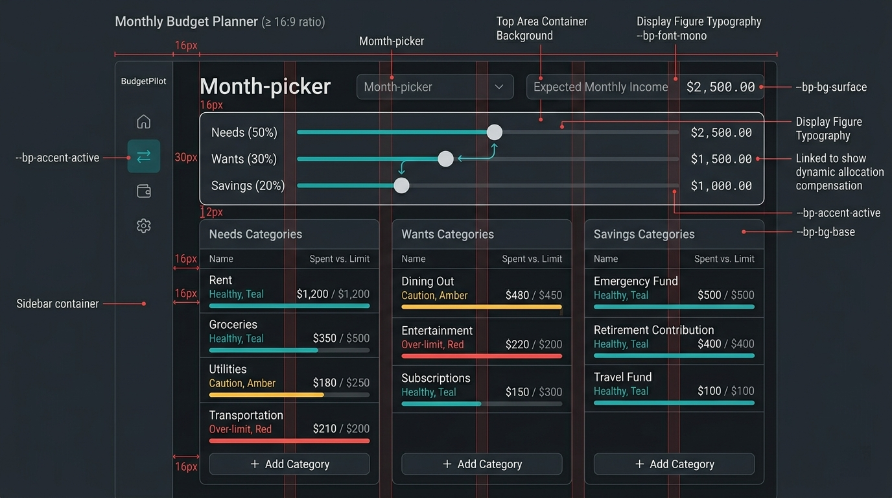

### **Tablet Version (768px – 1023px)**
* **Wireframe Prompt:** A tablet budget configuration screen optimized for vertical stacking and touch.
* **Layout Structure:** * **Header:** Centered income input area.
    * **Top Area:** 2x2 grid containing the income input and the three allocation sliders.
    * **Stack:** "Needs" and "Wants" groups are side-by-side; "Savings" categories span the full width below them.
* **Navigation & Interaction:** 64px Icon Rail; large block-style "Add Category" buttons for touch accuracy.
* **Visual Style:** High-contrast labels and monospace numbers for limits.

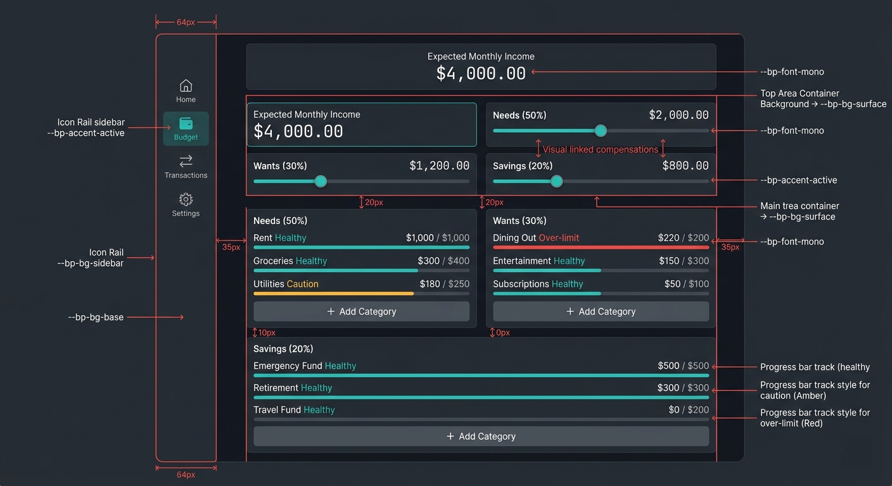

### **Mobile Version (< 768px)**
* **Wireframe Prompt:** A sequential, thumb-friendly budget setup flow (390x844px).
* **Layout Structure:**
    * **Header:** Sticky top card showing "Income Left to Assign" in teal.
    * **Top Area:** Three large stacked sliders with 44x44px hit areas and teal thumbs.
    * **Stack:** Budget groups (Needs, Wants, Savings) are collapsible accordions to minimize vertical scrolling.
* **Navigation & Interaction:** Persistent bottom tab bar; tapping a category opens an inline edit mode where the keypad appears.
* **Visual Style:** Vertical column stack optimized for scrolling with 44x44px touch targets.

---

## Feature 4: Smart CSV Import
**Goal:** Automate bank CSV mapping with intelligent bank fingerprinting.

### **Desktop Version (≥ 1024px)**
* **Wireframe Prompt:** A professional desktop UI wireframe (1920x1080px) for the "Smart CSV Import" flow.
* **Layout Structure:**
    * **Header:** A clean, horizontal stepper (1. Upload → 2. Map → 3. Review) at the top. Step 2 is active with a teal glow (`--bp-accent-active`).
    * **Top Area (Status):** A full-width success toast inside the content area with a `--bp-bg-surface` background. It reads: "Chase Bank detected. Mapping applied automatically." with a teal checkmark.
    * **Main Stack (The Mapping Grid):** A two-column high-density grid. 
        * **Left Column (CSV Headers):** Labels like "Transaction Date," "Description," and "Amount" in muted text.
        * **Right Column (App Fields):** Dropdown selectors pre-filled with mapping matches. Each row has a small teal "MAPPED" badge.
    * **Sidebar (Left):** A 64px Icon Rail showing the active "Import" icon in teal.
* **Visual Style & Tokens:**
    * **Theme:** **Strict Dark Mode.** Use `--bp-bg-base` for the screen and `--bp-bg-surface` for the mapping container.
    * **Typography:** All data samples (e.g., "$1,200.45") must use high-contrast monospace (`--bp-font-mono`).
    * **Mandatory Token Callouts:** * "Screen Background -> --bp-bg-base"
        * "Content Container -> --bp-bg-surface"
        * "Interactive Elements -> --bp-accent-active"
        * "Data/Numbers -> --bp-font-mono"

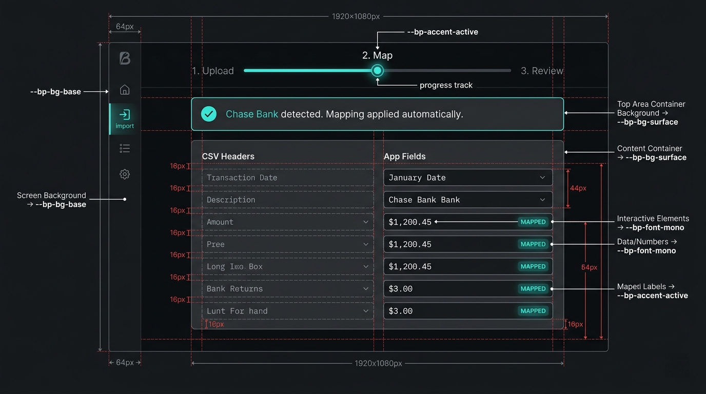

### **Tablet Version (768px – 1023px)**
* **Wireframe Prompt:** A tablet mapping workflow focusing on clear visual feedback.
* **Layout Structure:** * **Header:** Centered progress indicator.
    * **Top Area:** Success toast anchored at the top center.
    * **Stack:** Vertically stacked mapping cards. Below them, a swipeable carousel preview of the first 5 rows.
* **Navigation & Interaction:** 64px Icon Rail; large dropdown targets.
* **Visual Style:** Card-based UI for mapping fields.

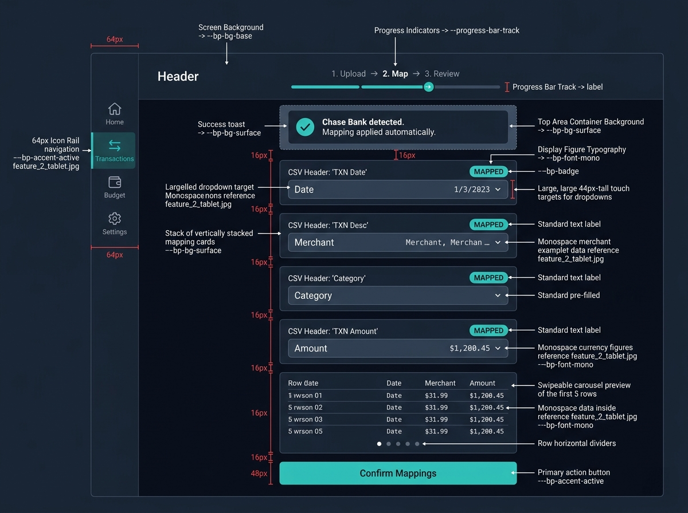

### **Mobile Version (< 768px)**
* **Wireframe Prompt:** A high-fidelity mobile wireframe (390x844px) for the CSV Mapping stage in a **Dark "Midnight" Theme**.
* **Layout Structure:**
    * **Header:** A condensed vertical stepper in the top right. Below it, the success toast "Chase Bank detected" is a slim banner.
    * **Stack (Vertical Mapping Cards):** Instead of a table, use a vertical list of cards. 
        * Each card represents one CSV column. 
        * **Card Top:** The raw CSV header name (e.g., "TXN_DT_STMT").
        * **Card Bottom:** A large 44px-tall dropdown for selecting the app field (e.g., "Date").
    * **Navigation:** A sticky bottom area containing a large, full-width teal "Confirm Mapping" button.
* **Interaction:** A "Drop Zone" is replaced with a "Select File from Device" button block (80% width).
* **Visual Style & Tokens:**
    * **Theme:** Deep charcoal palette. High-touch targets (min 44x44px).
    * **Token Callouts:**
        * "Mobile Surface -> --bp-bg-surface"
        * "Touch Target Size -> 44px"
        * "Primary Action -> --bp-accent-active"
        * "Numeric Data -> --bp-font-mono"
    * **Redline Specs:** Include 16px side margins and 12px vertical spacing between mapping cards.

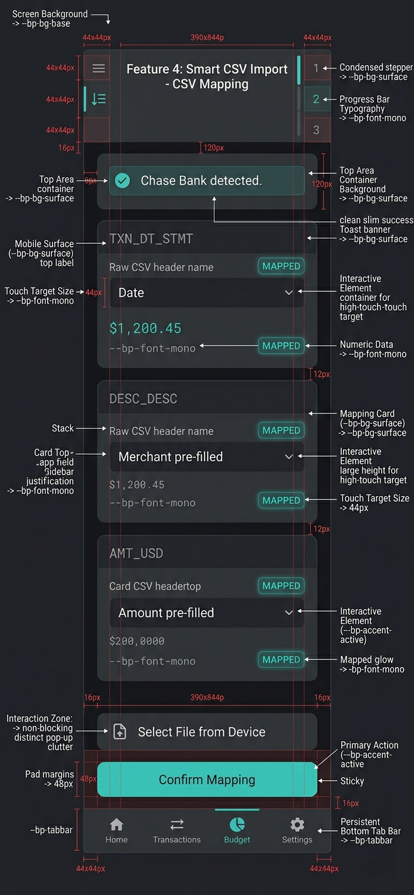

---

## Feature 5: Debt Snowball Calculator
**Goal:** Highlight the "Premium Slider" and the payoff timeline visualization.

### **Desktop Version (≥ 1024px)**
* **Wireframe Prompt:** A high-fidelity debt forecaster view with real-time payoff updates.
* **Layout Structure:**
    * **Header:** Toggle for "Snowball vs. Avalanche" and payoff metrics.
    * **Top Area:** Summary metrics for total debt, interest saved, and debt-free date.
    * **Stack:** A 40/60 split with a scrollable debt list on the left and a large bar chart on the right.
* **Navigation & Interaction:** Horizontal "Extra Monthly Payment" slider under the chart with a teal glow; bars re-animate as the slider moves.
* **Visual Style:** Midnight theme with `--bp-accent-glow` for the slider.

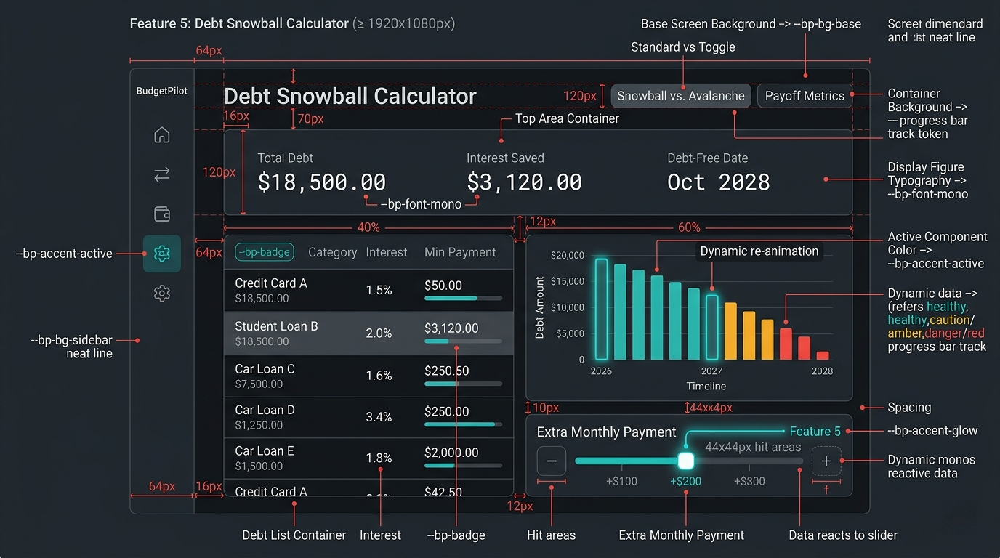

### **Tablet Version (768px – 1023px)**
* **Wireframe Prompt:** A vertical-stack debt calculator for tablet.
* **Layout Structure:** * **Header:** Payoff summary metrics centered.
    * **Top Area:** Full-width bar chart spanning the top.
    * **Stack:** Large "Extra Monthly Payment" card with the premium slider, followed by a 2-column grid of debt cards.
* **Navigation & Interaction:** 64px Icon Rail; 48px tall slider thumb.
* **Visual Style:** High-contrast chart bars and labels.

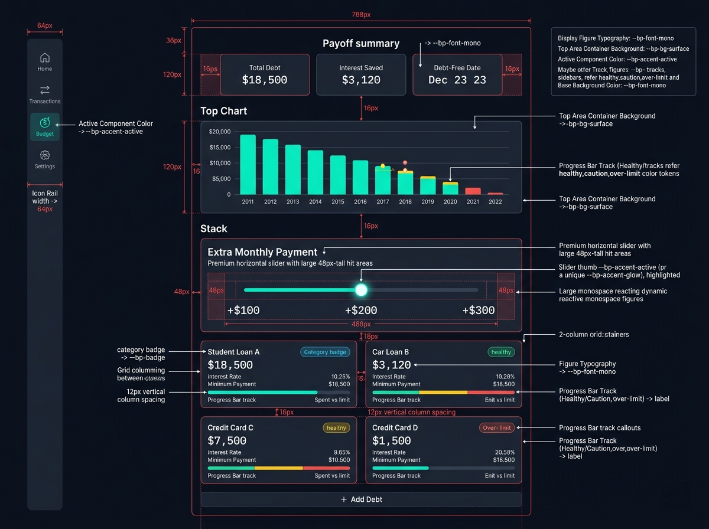

### **Mobile Version (< 768px)**
* **Wireframe Prompt:** A real-time payoff forecasting tool optimized for mobile (390x844px).
* **Layout Structure:**
    * **Header:** Bold "Interest Saved" card at the top.
    * **Top Area:** Simplified bar chart (years only).
    * **Stack:** Scrollable debt cards followed by a sticky "Extra Payment" slider at the bottom.
* **Navigation & Interaction:** Moving the sticky slider updates the "Debt-Free Date" card instantly via **Motion One**.
* **Visual Style:** 44x44px high-touch slider and high-contrast monospace dates.

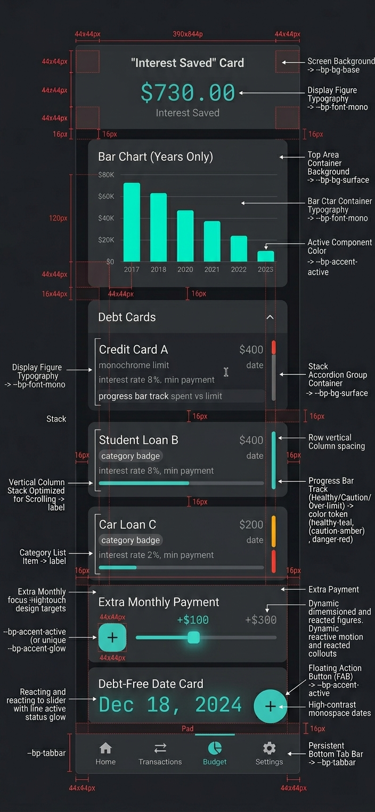

---

## Feature 6: Hot-Swappable Theme Engine
**Goal:** Showcase the theme upload mechanic and visual customization.

### **Desktop Version (≥ 1024px)**
* **Wireframe Prompt:** A theme engine dashboard showing swatches and live mockup previews.
* **Layout Structure:**
    * **Header:** "Appearance" settings title.
    * **Top Area:** Active theme card with its 5-color swatch strip.
    * **Stack:** A dashed-border "Upload Zone" next to a "Theme Preview Panel" showing a mini dashboard mockup.
* **Navigation & Interaction:** Drag-and-drop file upload; "Apply" and "Reset" buttons.
* **Visual Style:** Swatches show the accent and semantic colors in the current theme.

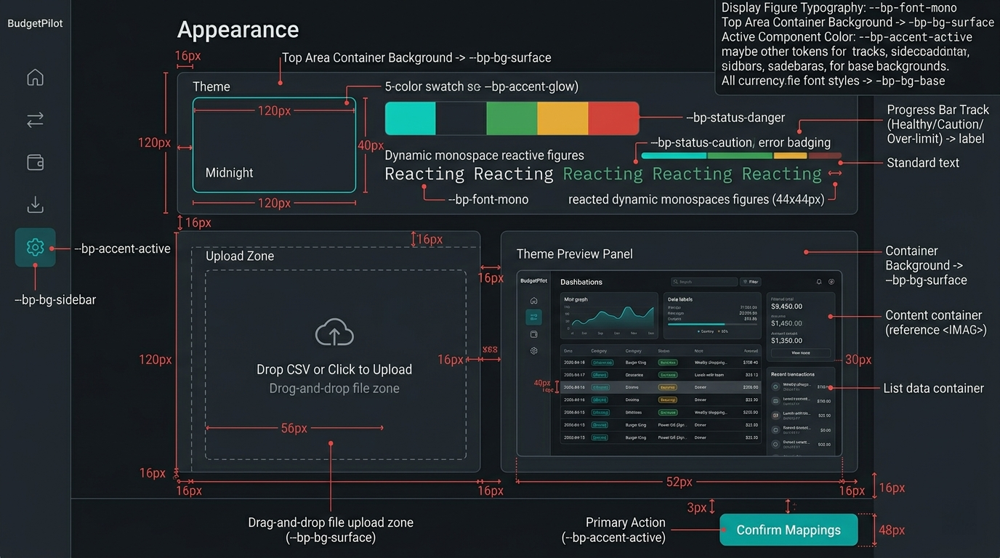

### **Tablet Version (768px – 1023px)**
* **Wireframe Prompt:** Card-based appearance settings for tablet.
* **Layout Structure:** * **Header:** Centered settings title.
    * **Top Area:** Full-width active theme card with swatches.
    * **Stack:** Large dashed upload area followed by the theme mockup preview below it.
* **Navigation & Interaction:** 64px Icon Rail; centered secondary buttons.
* **Visual Style:** Clean card separations with consistent padding.

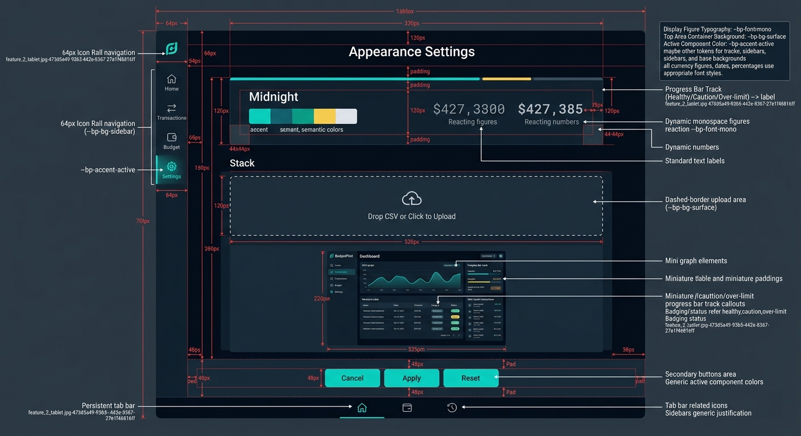

### **Mobile Version (< 768px)**
* **Wireframe Prompt:** A list-to-detail settings interface for PWA.
* **Layout Structure:**
    * **Header:** "Settings" title.
    * **Top Area:** Appearance sub-menu item.
    * **Stack:** Tapping "Appearance" slides in a full-screen manager with large "Apply" and "Reset" buttons.
* **Navigation & Interaction:** Bottom tab bar; large "Upload Theme" button (44px height).
* **Visual Style:** List-based navigation with 16px corner radiuses.

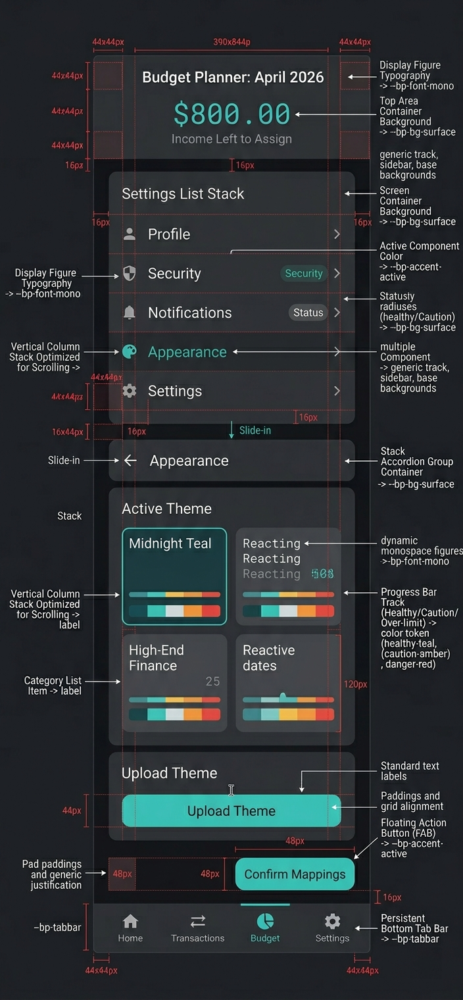

---

## Feature 7: Onboarding Flow
**Goal:** A frictionless, 3-step setup to personalize the PWA environment.

### **Desktop Version (≥ 1024px)**
* **Wireframe Prompt:** A cinematic, centered 800x600px setup card for desktop onboarding.
* **Layout Structure:**
    * **Header:** Welcome title with a 3-dot stepper.
    * **Top Area:** "Expected Income" input field.
    * **Stack:** Linked 50/30/20 sliders as the primary centerpiece of the card.
* **Navigation & Interaction:** Motion One "Fade + Slide" transitions between steps.
* **Visual Style:** Professional, clean aesthetic on a dark background.

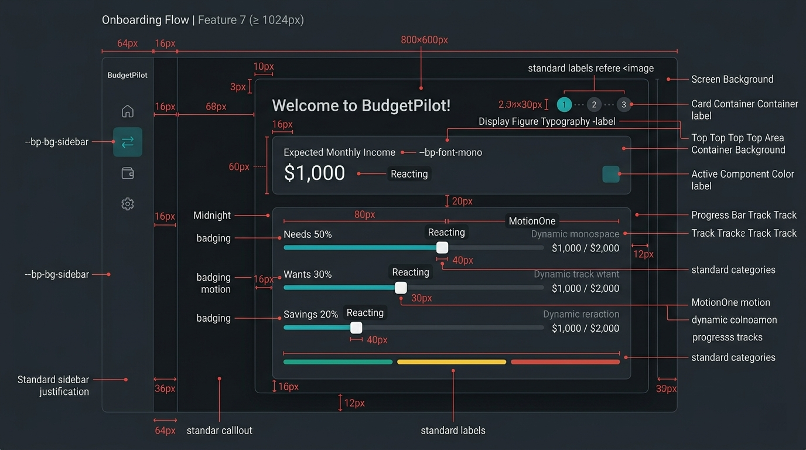

### **Tablet Version (768px – 1023px)**
* **Wireframe Prompt:** An onboarding experience optimized for tablet width.
* **Layout Structure:** * **Header:** Centered progress indicator.
    * **Top Area:** Income input field.
    * **Stack:** Centered onboarding card occupies 90% of the screen width with oversized sliders.
* **Navigation & Interaction:** 64px Icon Rail hidden during onboarding; large "Next" button.
* **Visual Style:** Consistent padding and large hit areas.

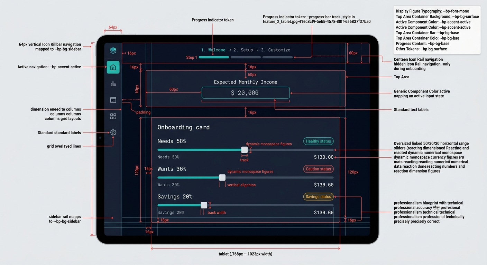

### **Mobile Version (< 768px)**
* **Wireframe Prompt:** A full-screen native onboarding experience for the PWA (390x844px).
* **Layout Structure:**
    * **Header:** 3-dot progress indicator at the top center.
    * **Top Area:** Step-specific title (e.g., "Set Your Foundation").
    * **Stack:** Single-column inputs followed by large stacked sliders for allocation.
* **Navigation & Interaction:** A large teal "Continue" button fixed to the bottom of the screen with a 16px margin.
* **Visual Style:** Step 3 features large tappable theme preview cards.

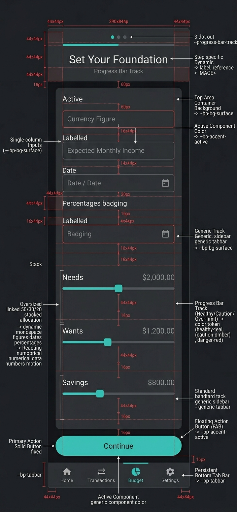

---

### **Technical Implementation Note**
Every prompt is designed to rely strictly on CSS variables (e.g., `var(--bp-bg-surface)`). No colors or durations are to be hardcoded, ensuring the **Theme Engine** works across all views. Numbers must use monospaced fonts for the financial-grade aesthetic.
